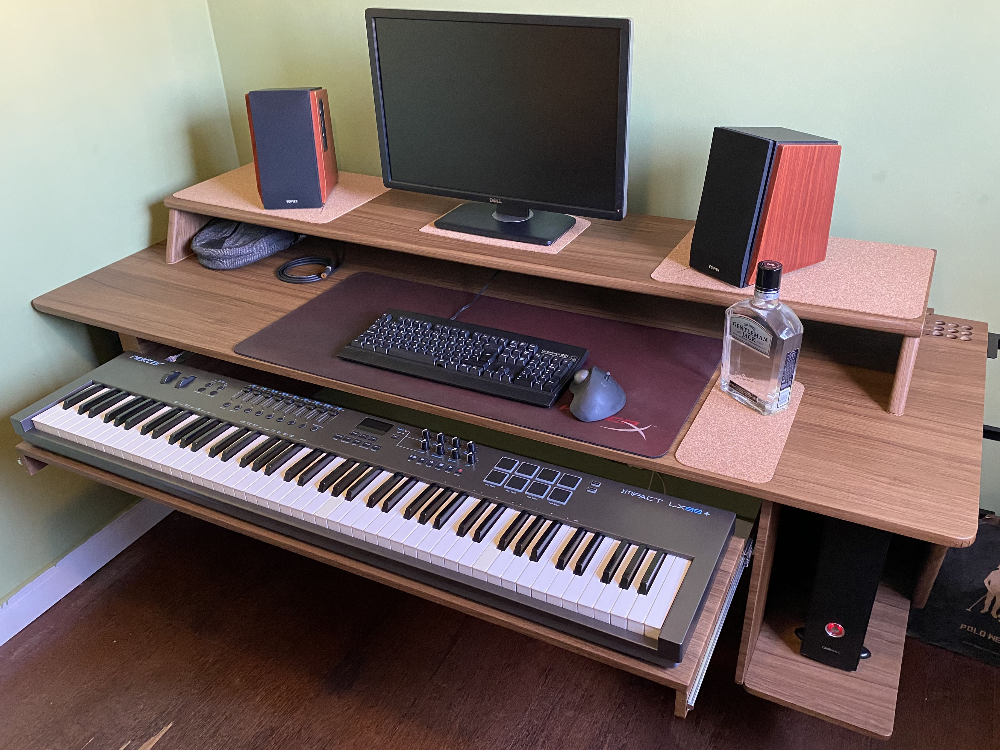

Hey, you!
Yes, you!
Have you not heard from me in a while?
Maybe I disappeared for what seemed an eternity?
Or maybe you do not know who I am, but want to know more about my current endeavours?
This is my [now page].
Here you can get a glimpse of what I am currently doing with my life.
Who knows, maybe you can find a tip here and there.

This page will be in constant motion, depending on my circumstances, so check it out every once and a while.
Last update was in **July 2024**.

[now page]: https://nownownow.com/about

## I Injured My Left Knee, Now I Am Getting Both Stronger Than Ever

Unfortunately I injured my left knee.
Not the first time this year, mind you.
But I am done with this recurrent situation.
Before, I had hurt them outside the gym, but now during an exercise I have noticed a serious issue.

I decided to fix this situation once and for all.
I took an entire month of rest, spending a lot of time deep diving into the issue and trying to solve it myself.
Whenever I face issues that are not life threatening, I like to take my time and learn.

Recently I found *Ben Patrick*, known on the Internet as *The Knee Over Toes Guy*.
Check [his story] and also [his YouTube channel].
His approach is unorthodox but also very sound.
I am doing the routine from his book [Knee Ability Zero] for a few weeks already and my legs are feeling incredible.
I will report back as progress occurs.

If you want to know more, read my post titled [I Am Not a Superman].

[his story]: https://www.atgonlinecoaching.com/articles/knee-ability-zero-ch-1
[his YouTube channel]: https://www.youtube.com/channel/UCGybO-bWZ3W6URh42sdMQiw
[Knee Ability Zero]: https://www.amazon.com/Knee-Ability-Zero-Ben-Patrick/dp/B09KNGDYGL
[I Am Not a Superman]: /blog/not-superman/

## I Finished My New Floating Desk Table

Admittedly, this project took much longer than it should have, but it ended up culminating into something that I am very proud of.
It is an amalgamation of several concepts that I have been researching since 2022, mixed and matched for my needs.
Maybe someday I will write in detail about it.

The mais source of success for this project was the fact that I have a mother who knows her way around carpentry.

## I Started to Dabble My Feet in the Vast Sales Ocean

Although I am not a fan of the modern mechanicist discourse around life—as an example, we are described as "meat robots" by some people—, there are some principles that are reasonably encapsulated within some of this vocabulary: human interaction revolves around *transactions*.
When looking for a wife, you will *sell* yourself to her as her soulmate;
when making friends with someone, you two are *bartering* comradeship;
when looking for a job, you are presenting yourself as an *asset* to a company;
and so on and so forth.

To people like me, closer to the introverted and shy side of life's equation, living life without sales skills is just bad.
You can divert your mind from this fact by neverending gaming sessions, marathoning your favorite series at any streaming service, or whatever suits your fancy, then choosing the best coping rationalization for why this is actually a good thing, but deep down you know that things could be improved if you knew how to present yourself better to the world.
Well, things *can* and *will* be better if we put some effort.

I do not know if learning online marketing/sales is a good start, but it is a start and this is more than enough for me.
You can expect to see some posts popping up around here about this subject—and its adjecent effects—, but none will be written as that disgraceful *Instagram millionarie guru* model that everyone seems to copy.
I will be writting to improve my learning, so expect some grounded, practical and realistic perspective on things as I learn, apply and improve on them.
